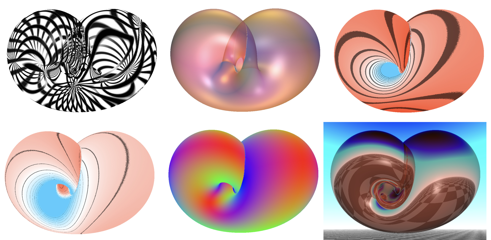

# AlgoSurfer - a simple implicit/algebraic surface viewer



## Overview

A real-time visualisation tool for implicit surfaces, i.e. isolevels
of real-value functions f(x,y,z). It casts rays through each pixel and
computes intersections with the surface.

<p style="text-align: center;"> Go to <a href="https://jacquesolivierlachaud.github.io/AlgoSurfer"> <b>AlgoSurfer Demo</b> </a> | <a href="https://jacquesolivierlachaud.github.io/AlgoSurfer/algosurfer-implicit-surface-viewer.html"> <b>AlgoSurfer</b> </a> </p>

## Main features

- it displays any implicit surface, either predefined or user-written, in real time.
- it displays either the surface, its normals, its mean or Gaussian curvatures or its principal directions.
- you can choose different illumination models (basic, Phong) but also use transparent materials or reflecting materials
- you can navigate around the shape with the mouse

## Predefined shapes

The tool offers several classical algebraic (Cayley Cubic, Whitney surface, etc) or implicit surfaces (Sierpinski cube, Kleinian variation, etc).


## Writing your own implicit function

Just write it in the textbox like:

```
// Torus example
return (x2+y2+z2+a*a-b*b)*(x2+y2+z2+a*a-b*b)-4.*a*a*(x2+y2);
```

Obviously, you have access to `x`, `y`, `z` variables (and even a temporal `t`), as well as their squared and cubic variants (`x2`, `x3`, ...). Use `x2*x3` if you want `x^5`.

You can also access user-interface parameters `a`, `b`, `c`.


The code should be written in GLSL (C-like) and then press `View
Surface`. If you do not know GLSL, the simplest way is to take
inspiration of the code written for predefined shapes.


## Details

- you can change the viewed `isolevel` (default is 0).
- `scale` allows you to zoom in/out of the surface.
- `center_x`, `center_y`, `center_z` changes the center of view
- you may decrease `accuracy` to get better details, at the price
  of increased computational burden (check fps above)
- `singularity` controls how singularity are detected, 1.0: large band
  0.0: invisible.
- you may change the `color_model` to change the color display of
  surfaces
  + `Basic`: just the natural color as defined by what you are viewing
  + `Phong`: Adds a simple Phong model with a front white light
  + `Phong+lights`: Adds a Phong model with two other parametrizable lights
- you may change the colors of the surface (diffuse inside/outside),
  specular, singularities.
- you may change `lights` colors and directions.
- `view_shape` changes the volume that encloses the isosurface.
- `view_radius` changes the sizes of the previous volume.
- `grid_size`, `grid_thickness` and `grid_attenuation` changes the
  display of overlayed grids/spheres/isolines.
- `rotation_x`, `rotation_y`, `rotation_z` changes the current object
  rotation speed.
- `stop` stops the rotations.
